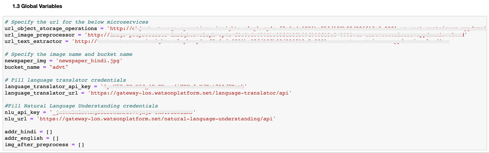

# Extract relevant text content from an image and derive insights

This code pattern demonstrates a methodology of deriving insights from scanned documents that has information organized into various sections or layouts.

Some of the scenarios encountered regularly in business are:
- A real estate company which scans newspaper classifieds to extract the individual classifieds. The classifieds appear in different layouts depending on the newspaper.
- In a bank, the supporting documents for a loan are scanned and uploaded. We have to extract some relevant information from the uploaded documents for further processing. Here the information is organized into sections, and the information we want is in one of the sections.
- Employers get scanned copies of certificates, government ids and other documents from employees joining the organization. They are verified for the details.
- In hospitals, a lot of times medical records are scanned and stored. They are later taken up for auditing and analysis. In such a scenario, we need to extract specific information from the records for analysis.

When we use an `OCR` tool directly on an image, we get text that is aggregated and mixed from the various sections. In the above described scenarios, we need to understand the layout and then retrieve only the information from individual sections.

Let us take the first scenario of the real estate company. The real estate classifieds are usually laid out in columns as shown below. Here, the individual classifieds must be identified and then the text content extracted.


Let us build a solution for this scenario to demonstrate our code pattern methodology. We will take a regional newspaper where the classifieds appear in `Hindi` language. This methodology can be extended to any other regional language.


We need to perform the following steps on the scanned image:
- Extract the individual classified information laid out in columns and rows
- Convert it to text format, translate if required, and extract the required information.

This solution is applicable to other use-case scenarios where we need to extract only relevant portions of text in images and get insights on them.

When the reader has completed this Code Pattern, they will understand how to:

* Containerize OpenCV, Tesseract and Cloud object storage client using an `Appsody` stack, and deploy them on an `OpenShift cluster on IBM Cloud`.
* Pre-process images to separate them into different sections using OpenCV
* Use Tesseract to extract text from an image
* Use Watson language translation to translate the text from `Hindi` to `English`.
* Use Watson Natural language Understanding to derive insights on the text.


<!--add an image in this path-->


<!--Optionally, add flow steps based on the architecture diagram-->
## Flow

1. The classifieds image is stored in Object storage, and the jupyter notebook execution is triggered.
2. The Object storage operations microservice is invoked.
3. The classifieds image from Object storage is retrieved.
4. The Image pre-processor service is invoked. The different sections in the image are identified and extracted into separate images each containing only one single classified.
5. The individual classified image is sent to the Text extractor service where the address text is extracted.
6. The extracted address text is sent to Watson Language Translator where the content is translated to English.
7. The translated text in English is sent to Watson Natural Language Understanding where the entities of interest is extracted to generate the required insights.

## Pre-requisites
* [IBM Cloud account](https://www.ibm.com/cloud/): Create an IBM Cloud account.
* [Python 3](https://www.python.org/downloads/): Install python 3.
* [Jupyter Software](https://jupyter.org/install): Install Jupyter Software.
* [Appsody CLI](https://appsody.dev/docs/installing/installing-appsody): Install Appsody CLI.

# Steps

Please follow the below to setup and run this code pattern.

1. [Clone the repo](#1-clone-the-repo)
2. [Create text extractor service](#2-create-text-extractor-service)
3. [Create image pre-processor service](#3-create-image-pre-processor-service)
4. [Create object storage operations service](#4-create-object-storage-operations-service)
5. [Setup Watson Language Translator](#5-setup-watson-language-translator)
6. [Setup Watson Natural Language Understanding](#6-setup-watson-natural-language-understanding)
7. [Run locally](#7-run-locally)
8. [Deploy and run on cloud](#8-deploy-and-run-on-cloud)
9. [Analyze the results](#8-analyze-the-results)

### 1. Clone the repo

Clone this [git repo](https://github.com/IBM/process-images-derive-insights).
Else, in a terminal, run:

```
$ git clone https://github.com/IBM/process-images-derive-insights
```
### 2. Create text extractor service

  #### 2.1 Create an appsody stack with Python Flask and Tesseract support

  Please refer to the below 3 steps in the tutorial [Create a custom Appsody stack with support for Python Flask and Tesseract](https://developer.ibm.com/tutorials/create-a-custom-appsody-stack-with-python-flask-and-tesseract-support/) to create the appsody stack.

a. [Create a copy of an Appsody Python Flask stack](https://developer.ibm.com/tutorials/create-a-custom-appsody-stack-with-python-flask-and-tesseract-support/#1-create-a-copy-of-an-appsody-python-flask-stack)

b. [Modify the Python Flask stack to add support for Tesseract](https://developer.ibm.com/tutorials/create-a-custom-appsody-stack-with-python-flask-and-tesseract-support/#2-modify-the-python-flask-stack-to-add-support-for-tesseract)

c. [Build the stack](https://developer.ibm.com/tutorials/create-a-custom-appsody-stack-with-python-flask-and-tesseract-support/#3-build-the-stack)

   #### 2.2 Create an appsody project using the new stack

  Create a new empty folder say `text_extractor`. Create an appsody project inside the newly created folder by running the below commands:

   ```
   $ cd text_extractor
   $ appsody init dev.local/python-flask-tesseract
   ```

  Copy the file `__init__.py` under the folder `sources/text_extraction/` in this repo that you have cloned.

  Replace file `__init__.py` under folder `text_extractor` with `__init__.py` under the folder `sources/text_extraction/` in this repo that you have cloned.

  #### 2.3 Build and test the project

  Goto the `text_extractor` folder and run the below commands:
  ```
  $ appsody build
  $ appsody run -p 3501:8080 -p 3502:5678
  ```

Open the url http://localhost:3501/home

If it says, `Your text extraction application test is successful` then your application is working fine.
Press Ctrl+C on the terminal to stop the running server.


### 3. Create image pre-processor service

  #### 3.1 Create an appsody stack with Python Flask and OpenCV support

  Please refer to the below 3 steps in the tutorial [Create a custom Appsody stack with support for Python Flask and OpenCV](https://developer.ibm.com/tutorials/create-a-custom-appsody-stack-with-python-flask-and-opencv-support/) to create the appsody stack.

a. [Create a copy of an Appsody Python Flask stack](https://developer.ibm.com/tutorials/create-a-custom-appsody-stack-with-python-flask-and-opencv-support/#1-create-copy-of-python-flask-stack)

b. [Modify the Python Flask stack to add support for Tesseract](https://developer.ibm.com/tutorials/create-a-custom-appsody-stack-with-python-flask-and-opencv-support/#2-modify-the-python-flask-stack-to-add-support-for-opencv)

c. [Build the stack](https://developer.ibm.com/tutorials/create-a-custom-appsody-stack-with-python-flask-and-opencv-support/#3-build-the-stack)

 #### 3.2 Create an appsody project using the new stack

  Create a new empty folder say `image_preprocessor`. Create an appsody project inside the newly created folder by running the below commands:

   ```
   $ cd image_preprocessor
   $ appsody init dev.local/python-flask-opencv
   $ mkdir images
   ```

  Copy the files `__init__.py` and `improcess.py` under the folder `sources/image_preprocessor/` in this repo that you have cloned.

  Replace file `__init__.py` under folder `image_preprocessor` with `__init__.py` under the folder `sources/image_preprocessor/` in this repo that you have cloned.

  Replace file `improcess.py` under folder `image_preprocessor` with `improcess.py` under the folder `sources/image_preprocessor/` in this repo that you have cloned.

#### 3.3 Build and test the project

  Goto the `image_preprocessor` folder and run the below commands:
  ```
  $ appsody build
  $ appsody run -p 4501:8080 -p 4502:5678
  ```

  Open the url http://localhost:4501/home

  If it says, `Your image preprocessor application test is successful` then your application is working fine. Press Ctrl+C on the terminal to stop the running server.

### 4. Create object storage operations service

 #### 4.1 [TODO - Link tutorial steps]

 #### 4.2 Create an instance of IBM Cloud Object Storage

Create an instance of [IBM Cloud Object Storage](https://cloud.ibm.com/catalog/services/cloud-object-storage).


Create credentials for the newly created Cloud Object service

* Click on `Credentials`
* Click on `New Credential`. Make a note of the newly created credential in json format.


Create a bucket and upload an image to the bucket

* Click on `Buckets`
* Click on `Create bucket`


* Select `Standard` under `Predefined buckets`


* Give a name under `Unique bucket name` like `classifieds` and click on `Next`


* Click on `Browse and upload` and upload the image `newspaper_hindi.jpg` under `sources/object_storage_operations/` in this repo that you have cloned and click on `Next`.


* Click on `Next` in `Test bucket out` section.

* In `Summary` section click on `View Buckets` and search for your bucket `classifieds` in the search tab.


* When you click on your bucket, it should show `newspaper_hindi.jpg` image in the bucket.


* You have now successfully created a bucket and uploaded an image.

#### 4.3 Create an appsody project using the new stack

Create a new empty folder say `object_storage_operations`. Create an appsody project inside the newly created folder by running the below commands:
 ```
 $ cd object_storage_operations
 $ appsody init dev.local/python-flask-os ostemplate
 ```
The files `Pipfile`,`osclient.py` and `config.ini` are created under the `object_storage_operations` folder.

Copy the files `__init__.py` under the folder `sources/object_storage_operations/` in this repo that you have cloned.

Place file `__init__.py` under folder `app3` with `__init__.py` under the folder `sources/object_storage_operations/` in this repo that you have cloned.

 * The file `__init__.py` has REST interfaces exposed to test the Cloud Object Storage operations.

Modify the contents of config.ini with the credentials that we created earlier.

Credentials we noted earlier on IBM Cloud:


The relevant portions indicated in the credentials are entered into the `config.ini` as shown below:


Modify the `COS_BUCKET_LOCATION` appropriately. The list of valid location constraints can be found [here](https://cloud.ibm.com/docs/services/cloud-object-storage?topic=cloud-object-storage-classes#classes-locationconstraint).

#### 4.4 Build and test the project

  Goto the `object_storage_operations` folder and run the below commands:
  ```
  $ appsody build
  $ appsody run -p 5501:8080 -p 5502:5678
  ```

  Open the url http://localhost:5501/home.

  If it says, `Your object storage operations application test is successful` then your application is working fine. Press Ctrl+C on the terminal to stop the running server.

### 5. Setup Watson Language Translator

Create an instance of [IBM Language Translator](https://cloud.ibm.com/catalog/services/language-translator).


Copy the `Credentials`, both `API Key` and `URL` as shown below and make a note of them. We will use them in step 7.


### 6. Setup Watson Natural Language Understanding

Create an instance of [IBM Natural Language Understanding](https://cloud.ibm.com/catalog/services/natural-language-understanding).


Copy the `Credentials`, both `API Key` and `URL` as shown below and make a note of them. We will use them in step 7.


### 7. Run locally

 #### Start the services

 Goto the `text_extractor` folder and run the below commands:
  ```
  $ appsody run -p 3501:8080 -p 3502:5678
  ```
 Goto the `image_preprocessor` folder and run the below commands:
  ```
  $ appsody run -p 4501:8080 -p 3502:5678
  ```
 Goto the `object_storage_operations` folder and run the below commands:
  ```
  $ appsody run -p 5501:8080 -p 3502:5678
  ```

 #### 7.2 Set up and run jupyter notebook

 * Launch jupyter notebook.
 * Upload `process_image_insights.ipynb` which is under `notebook` folder in this repo that you have cloned.
 * Goto `section 1.3` in the notebook.

 

 * Specify the urls for the `text_extractor`(http://localhost:3501), `image_preprocessor`(http://localhost:4501) and `object_storage_operations`(http://localhost:5501). 
 * Fill the Language translator and Natural language understanding credentials that you have noted in step 5 and step 6 accordingly.

 * Click on `Run All` under `Cell` tab. Else you can run the notebook cell by cell by clicking on `Run` on each cell.

### 8. Deploy and run on cloud

 #### 8.1 Create an instance of OpenShift cluster on IBM Cloud

Create a OpenShift cluster [here](https://cloud.ibm.com/kubernetes/catalog/openshiftcluster).


 #### 8.2 Open the OpenShift console


 #### 8.3 Log in to OpenShift using the CLI and create a new project


 #### 8.4 Create a route for your Docker registry if not already created

```
  $ oc project default
  $ oc get svc
```

The output appears as shown below:

```
  NAME               TYPE           CLUSTER-IP       EXTERNAL-IP      PORT(S)                      AGE
  docker-registry    ClusterIP      172.21.xxx.xx    <none>           5000/TCP                     18h
  kubernetes         ClusterIP      172.21.x.x       <none>           443/TCP,53/UDP,53/TCP        18h
  myfirstosdeploy    ClusterIP      172.21.xx.xxx    <none>           5000/TCP                     17h
  registry-console   ClusterIP      172.21.xxx.xxx   <none>           9000/TCP                     18h
  router             LoadBalancer   172.21.xx.x      169.47.xxx.xxx   80:31297/TCP,443:30385/TCP   18h

```
 #### 8.5 Run the following command to create a route to the Docker registry

```
  $ oc create route reencrypt --service=docker-registry
```

 #### 8.6 Check the create route details

```
  $ oc get route docker-registry
```

The output appears as shown below:
```
 NAME              HOST/PORT                                                                                                            PATH      SERVICES          PORT       TERMINATION   WILDCARD
  docker-registry   docker-registry-default.clustersiteam-5290cxxxxxxxxxxd1b85xxx-0001.us-east.containers.appdomain.cloud               docker-registry   5000-tcp   reencrypt     None
```

 #### 8.7 Note the Docker registry URL that is displayed with the pattern — docker-registry-default.<cluster_name>-<ID_string>.<region>.containers.appdomain.cloud

Set it as a variable.

```
 export IMAGE_REGISTRY=docker-registry-default.<cluster_name>-<ID_string>.<region>.containers.appdomain.cloud
```

 #### 8.8 Log in to the Docker registry

```
  docker login -u $(oc whoami) -p $(oc whoami -t) $IMAGE_REGISTRY
```

 #### 8.9 Create a new project

Let us create a project by name `insights`.

```
    oc new-project insights
```

Give root permissions to the `default` service account.
```
    oc adm policy add-scc-to-user anyuid -z default
```

 #### 8.10 Deploy the text extractor service

Go to the appsody folder `text_extractor` we created earlier on the terminal. Run the command below:
```
 appsody deploy --tag insights/text-extractor --push-url $IMAGE_REGISTRY --push --pull-url docker-registry.default.svc.cluster.local:5000
```

 #### 8.11 Deploy the image pre-processor service

Go to the appsody project folder `image_preprocessor` we created earlier on the terminal. Run the command below:
```
 appsody deploy --tag insights/image-preprocessor --push-url $IMAGE_REGISTRY --push --pull-url docker-registry.default.svc.cluster.local:5000
```

 #### 8.12 Deploy the object storage operations service

Go to the appsody project folder `object_storage_operations` we created earlier on the terminal. Run the command below:
```
 appsody deploy --tag insights/object-storage-operations --push-url $IMAGE_REGISTRY --push --pull-url docker-registry.default.svc.cluster.local:5000
```
 #### 8.13 Create a new app on OpenShift for the services

Run the commands below:
```
$oc new-app --image-stream=text-extractor --name=text-extractor
$oc expose svc/text-extractor
$oc new-app --image-stream=image-preprocessor --name=image-preprocessor
$oc expose svc/image-preprocessor
$oc new-app --image-stream=object-storage-operations --name=object-storage-operations
$oc expose svc/object-storage-operations
```

You can see the application deployed under the insights project on the OpenShift web console. Note down the urls for the services as shown.


 #### 8.14 Create an instance of Watson Studio

Create an instance of Watson Studio [here](https://cloud.ibm.com/catalog/services/watson-studio)


Click `Create`.

 #### 8.15 Import the notebook and configure

Create a new project `insights` by selecting `New Project`.


Select `Add to project` and `Notebook`.


Import the notebook `process_image_insights.ipynb` which is under `notebook` folder in this repo that you have cloned. Click `Create notebook`.


Goto `section 1.3` in the notebook.

 

 * Specify the urls for the `image_preprocessor`, `text_extractor` and `object_storage_operations`.
 * Fill the Language translator and Natural language understanding credentials that you have noted in step 5 and step 6 accordingly.
 * Click on `Run All` under `Cell` tab. Else you can run the notebook cell by cell by clicking on `Run` on each cell.

### 9. Analyze the results

In section 2.1 of the notebook, we have retrived the required image `newspaper_hindi.jpg` from the Cloud Object Storage.


In section 3.1 of the notebook, we have preprocessed the image using opencv to detect different addresses in the newspaper.


In section 4.1 of the notebook, we have extracted all the different addresses that were detected after the preprocessing using tesseract.


In section 5.1 of the notebook, we have translated all the extracted addresses using `Watson Language Translator` service. This will help us in data processing and analytics.


In section 6.1 of the notebook, we have used `Watson Natural Language Understanding` service to derive insights from the data.
In our case, the insights uncovers that `50% of the detected addresses are from Karnataka state`, `25% of the detected addresses are from West Bengal state` and the other `25% of the detected addresses are from Maharashtra state`. We can also choose to see comparision between two states, like between Karnataka and Maharashtra.


In section 7.1 of the notebook, we can search for addresses in the newspaper based on the location name. Type an address in the location text box and press enter. It will return you all the addresses in the newspaper from the specified locality .


Lets type `Karnataka` and press enter,


Similarly, lets now try with `West Bengal` and press enter,


# Related Content

1. [Create a custom Appsody stack with support for Python Flask and Tesseract](https://developer.ibm.com/tutorials/create-a-custom-appsody-stack-with-python-flask-and-tesseract-support/)
TODO - provide tutorial links
