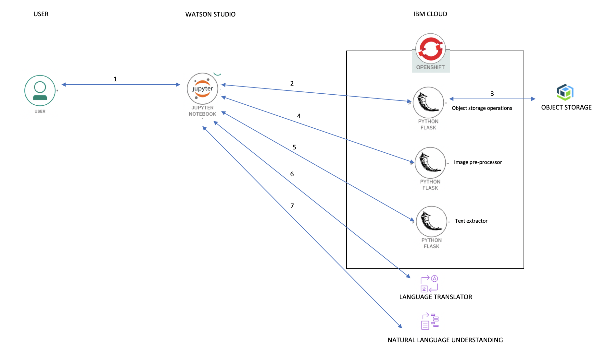

## Short Name

Extract relevant text content from an image and derive insights

## Short Description

Process and deriving insights from scanned documents that has information organized into various sections or layouts.

## Author
Rahul Reddy Ravipally (https://developer.ibm.com/profiles/raravi86/)

Balaji Kadambi (https://developer.ibm.com/profiles/bkadambi/)

## Code
https://github.com/IBM/process-images-derive-insights

## Video
NA

## Summary

This code pattern demonstrates a methodology of deriving insights from scanned documents that has information organized into various sections or layouts.

Extracting information specific sections from a newspaper/scanned document and processing them is a very inefficient and tedious job, especially when there are thousands of documents. Whats if we extract the secions and also give you insights about those sections? Wouldn't it be much easier and more efficient ? We are doing exactly the same, in this code pattern.
This code pattern demonstrates a methodology of deriving insights from scanned documents that has information organized into various sections or layouts.

## Description

In this code patterns we make use of various appsody stacks, to build required microservices and deploy them on OpenShift cluster on IBM Cloud. We use a master application deployed on wastson studio to orchestrate betweeen these microservices, to process and extract information from the scanned documents that has information organized into various sections or layouts. The information extracted is feed to Watson Language Translator service which converts non-english text into english text. This converted text is feed to Watson Natural Language Understanding service which gives us key information in the text. We use the output given by Watson Language Understanding service to form meaningful graphical insights.

When the reader has completed this Code Pattern, they will understand how to:

Containerize OpenCV, Tesseract and Cloud object storage client using an Appsody stack, and deploy them on an OpenShift cluster on IBM Cloud.
Pre-process images to separate them into different sections using OpenCV
Use Tesseract to extract text from an image
Use Watson language translation to translate the text from Hindi to English.
Use Watson Natural language Understanding to derive insights on the text.

## Flow

1. The classifieds image is stored in Object storage, and the jupyter notebook execution is triggered.
2. The Object storage operations microservice is invoked.
3. The classifieds image from Object storage is retrieved.
4. The Image pre-processor service is invoked. The different sections in the image are identified and extracted into separate images each containing only one single classified.
5. The individual classified image is sent to the Text extractor service where the address text is extracted.
6. The extracted address text is sent to Watson Language Translator where the content is translated to English.
7. The translated text in English is sent to Watson Natural Language Understanding where the entities of interest is extracted to generate the required insights.

## Included components

* [IBM Cloud account](https://www.ibm.com/cloud/): IBM cloud computing is a set of cloud computing services for business offered by the information technology company IBM.

* [Jupyter Software](https://jupyter.org/install): Project Jupyter is a nonprofit organization created to "develop open-source software, open-standards, and services for interactive computing across dozens of programming languages".

* [Appsody CLI](https://appsody.dev/docs/installing/installing-appsody): Appsody enables you to quickly build and deploy cloud-native applications.

## Featured technologies

* [OpenShift Container Platform](https://www.openshift.com/): Red Hat OpenShift offers a consistent hybrid cloud foundation for building and scaling containerized applications.
* [Cloud](https://en.wikipedia.org/wiki/Cloud_computing): Accessing computer and information technology resources through the Internet.
* [Containers](https://www.ibm.com/cloud/learn/containers): Virtual software objects that include all the elements that an app needs to run.
* [Python 3](https://www.python.org/downloads/): Python is an interpreted, high-level, general-purpose programming language.

## Links

1. [Create a custom Appsody stack with support for Python Flask and Tesseract](https://developer.ibm.com/tutorials/create-a-custom-appsody-stack-with-python-flask-and-tesseract-support/)

TODO - provide tutorial links
