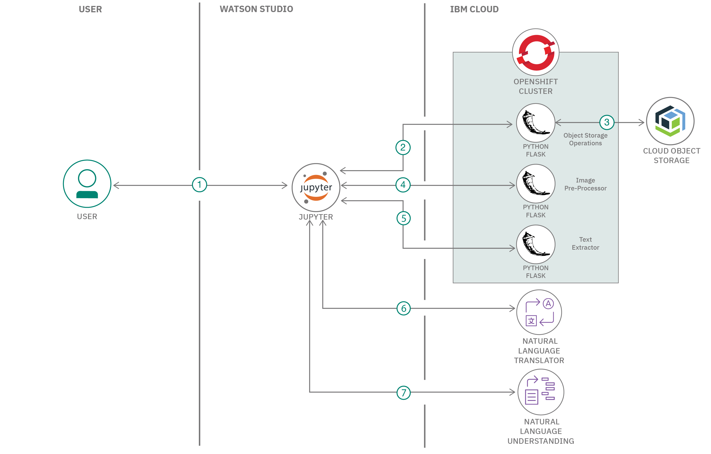

## Short Name

Extract relevant text content from an image and derive insights

## Short Description

Process and derive insights from scanned documents that display information in various sections or layouts

## Author
Rahul Reddy Ravipally (https://developer.ibm.com/profiles/raravi86/)

Balaji Kadambi (https://developer.ibm.com/profiles/bkadambi/)

## Code
https://github.com/IBM/process-images-derive-insights

## Video
NA

## Summary

Extracting information from specific sections of a newspaper or scanned document and processing them is an inefficient and tedious job, especially when there are thousands of documents. What if you could programmatically extract information from different sections in the document while simultaneously gaining insights about those sections?

This code pattern shows you how to derive insights from scanned documents that display information in various sections or layouts. In this pattern, the information gathered from the documents needs to be translated to English so that the user can derive insights from the docs.

## Description

This code pattern shows you how to use various [Appsody stacks](https://appsody.dev/docs/stacks/stacks-overview/) to build required microservices and deploy them to a Red Hat OpenShift cluster on IBM Cloud. A master application deployed on Watson Studio is used to orchestrate between the microservices that help process and extract information from the scanned documents. 

The extracted information is fed to a Watson Language Translator service which converts non-English text into English text. This converted text is fed to a Watson Natural Language Understanding service which provides key information in the text. We use the output given by Watson Language Understanding service to form meaningful graphical insights.

After completing this code pattern, you will understand how to:

* Containerize OpenCV, Tesseract, and a Cloud object storage client using an Appsody stack and deploy them on an OpenShift cluster on IBM Cloud.
* Pre-process images to separate them into different sections using OpenCV.
* Use Tesseract to extract text from an image
* Use Watson Language Translation to translate the text from Hindi to English.
* Use Watson Natural language Understanding to derive insights on the text.

## Flow

1. The classifieds image is stored in Object storage<!--EM: Any object storage? Or IBM Cloud Object Storage?--> <!--BK: Its IBM Cloud Object Storage -->, and the Jupyter notebook execution is triggered.
2. The Object storage operations microservice is invoked.
3. The classifieds image from the Object storage is retrieved.
4. The Image pre-processor service is invoked. The different sections in the image are identified and extracted into separate images, with each image containing only one single classified.
5. The individual classified image is sent to the Text extractor <!--EM: What is this text extractor service? Is that part of Tesseract?--><!--BK: Yes we create a service to invoke APIs on Tesseract.-->service where the address text is extracted.
6. The extracted address text is sent to Watson Language Translator where the content is translated to English.
7. The translated text in English is sent to Watson Natural Language Understanding where the entities of interest is extracted to generate the required insights.

## Included components

* [IBM Cloud account](https://www.ibm.com/cloud/): IBM cloud computing is a set of cloud computing services for business offered by the information technology company IBM.

* [Jupyter Software](https://jupyter.org/install): Project Jupyter is a nonprofit organization created to "develop open-source software, open-standards, and services for interactive computing across dozens of programming languages".

* [Appsody CLI](https://appsody.dev/docs/installing/installing-appsody): Appsody enables you to quickly build and deploy cloud-native applications.

## Featured technologies

* [OpenShift Container Platform](https://www.openshift.com/): Red Hat OpenShift offers a consistent hybrid cloud foundation for building and scaling containerized applications.
* [Cloud](https://en.wikipedia.org/wiki/Cloud_computing): Accessing computer and information technology resources through the Internet.
* [Containers](https://www.ibm.com/cloud/learn/containers): Virtual software objects that include all the elements that an app needs to run.
* [Python 3](https://www.python.org/downloads/): Python is an interpreted, high-level, general-purpose programming language.

## Links

1. [Create a custom Appsody stack with support for Python Flask and Tesseract](https://developer.ibm.com/tutorials/create-a-custom-appsody-stack-with-python-flask-and-tesseract-support/)

2. [Create a custom Appsody stack with support for Python Flask and OpenCV](https://developer.ibm.com/tutorials/create-a-custom-appsody-stack-with-python-flask-and-opencv-support/)

3. [Create a custom Appsody stack with template for IBM Cloud Object Storage operations](https://developer.ibm.com/tutorials/create-custom-appsody-stack-template-ibm-cloud-object-storage/)
